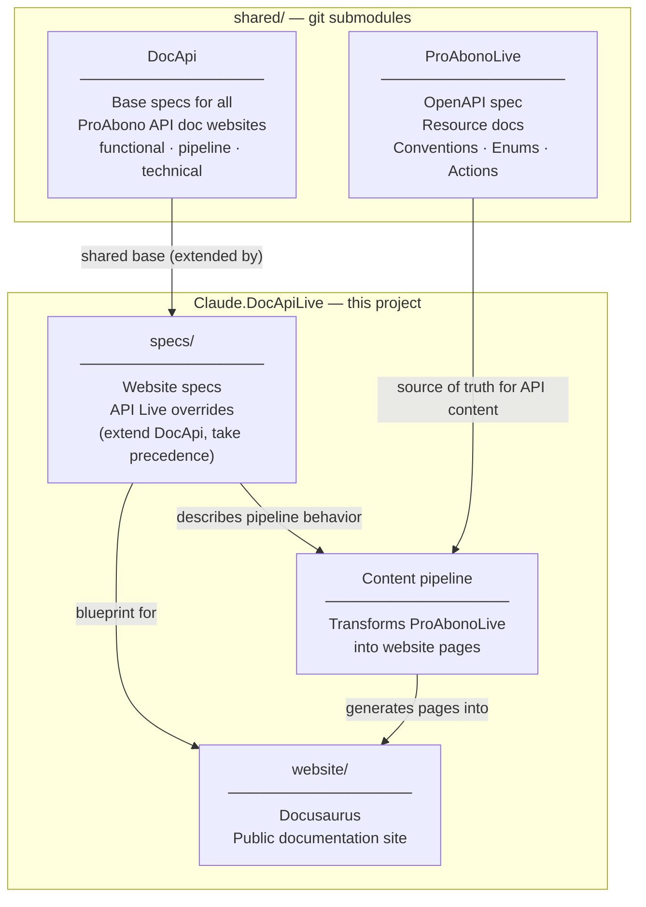

# Website Description

This folder contains the requirements and specifications for the **ProAbono API Live documentation website**.

Its purpose is to give a language model (such as Claude Code) everything it needs to implement the website from scratch, without any prior context.

## How to use this folder

Read this file first, then follow the links below in order. The specification has two layers:

1. **Shared base (DocApi)** — applies to all ProAbono API documentation websites
2. **API Live overrides** — what is specific to this website; takes precedence over DocApi

## Shared base specifications (DocApi)

All ProAbono API documentation websites share a common foundation. Read the DocApi specifications first — they define the base design, stack, pipeline architecture, and implementation patterns.

Shared spec root: [`shared/DocApi/`](../shared/DocApi/)

The three categories below mirror the DocApi structure. Each category index lists the relevant DocApi files alongside the API Live overrides, and notes which project files extend or replace the shared defaults.

## 1. Functional — what to build

[functional/](functional/) describes the website from the user's perspective: what pages exist, what they contain, what the navigation looks like, and what the visual design is. Stack-agnostic.

See [functional/index.md](functional/index.md) for the full file list.

## 2. Pipeline — how content flows in

[pipeline/](pipeline/) describes the processes that feed the site with content from the OpenAPI spec and the ProAbonoLive resource docs.

See [pipeline/index.md](pipeline/index.md) for the full file list.

## 3. Technical — how it is implemented

[technical/](technical/) describes the technical choices: Docusaurus, plugin configuration, build commands, deployment. Contains everything that would change if the stack were replaced.

See [technical/index.md](technical/index.md) for the full file list.

## Separation of concerns

Each category has a strict scope. When writing or reviewing a spec file, apply these rules:

### Functional specs must NOT contain

- Website folder or file structure (e.g. `docs/api-reference/`, `sidebar.ts`)
- Tool names or framework-specific concepts (e.g. Docusaurus, MDX, plugins)
- Details about how content is generated or where it comes from (e.g. "auto-generated from the OpenAPI spec", "the plugin writes flat MDX files")
- Any statement that would become wrong if the stack were replaced

**What to write instead:** describe the outcome from the user's perspective. If the origin of the content matters, reference the pipeline specs in a single vague sentence — link to [pipeline/index.md](pipeline/index.md), not to a specific file inside it.

> **Example — wrong:** "Auto-generated by the content pipeline from the OpenAPI spec. The plugin writes flat MDX files directly into `docs/api-reference/`."
>
> **Example — right:** "Each API operation has its own page. How these pages are produced is described in the [pipeline specifications](pipeline/index.md)."

### Pipeline specs must NOT contain

- Stack-specific configuration (e.g. plugin options, `package.json` scripts, `sidebars.js`)
- Website folder structure details that belong to the technical implementation

### Technical specs must NOT contain

- User-facing concerns (what a page looks like, what sections it has)
- Business logic or content decisions (which endpoints to document, what a concept means)

### Cross-referencing between specs

When one spec needs to point to another, reference the **index** of that category, not a specific file inside it. This keeps internal linking stable when files are reorganized.

> **Right:** "…is described in the [pipeline specifications](pipeline/index.md)."
>
> **Wrong:** "…see [pipeline/content-pipeline.md](pipeline/content-pipeline.md) for details."

## Relationship to the API specs

The website documents the ProAbono API Live. The API specs live in [shared/ProAbonoLive/](../shared/ProAbonoLive/). The website implementation must treat those specs as the source of truth for all API-related content.

**This website is public documentation.** When working on any part of the API Reference — content, navigation, grouping, or ordering — read [`shared/ProAbonoLive/specs/authoring.md`](../shared/ProAbonoLive/specs/authoring.md) first. It is the mandatory source of truth for how resources are presented in public-facing targets.
